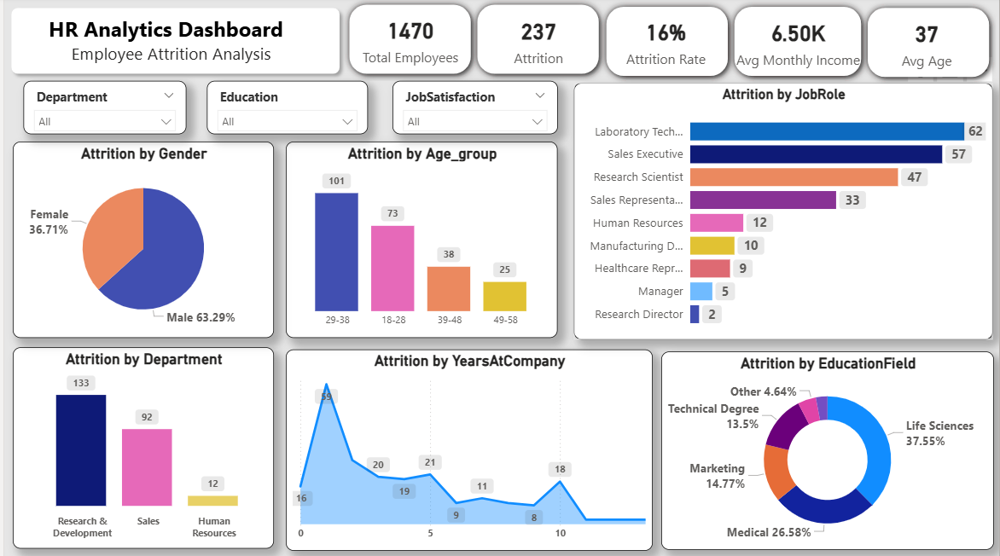

# HR Analytics Dashboard – Power BI

## Project Overview

This project focuses on analyzing HR data to understand employee attrition, workforce distribution, and job satisfaction.
The dashboard is built using Power BI and provides interactive visualizations that help identify important HR trends and patterns.

---

## Problem Statement

Employee attrition is a major challenge for organizations.
This project aims to analyze HR data and identify the key factors that influence employee turnover and overall workforce performance.

---

## Objectives

* Analyze employee attrition trends in the organization
* Study workforce distribution across departments and job roles
* Understand employee demographics such as age and education
* Evaluate job satisfaction and performance ratings
* Provide insights to support better HR decision-making

---

## Tools & Technologies Used

* Power BI
* Data Cleaning
* Data Visualization
* HR Data Analysis

---

## Dashboard Insights

* Overall employee count and attrition rate
* Department-wise employee distribution
* Job role analysis
* Job satisfaction levels
* Employee age group analysis

---

## Dashboard Preview

(Add your dashboard screenshot here)

---

## Files Included

* HR Analysis Dashboard.pbix – Power BI project file
* dashboard.png – Dashboard screenshot
* README.md – Project documentation

---

## Author

Prajakta Kumbhar

